# 👾 spriteanimations

A lightweight 2.5D sprite animation and rendering engine for Nico.
Built for fast prototyping, clean animation handling, and buttery-smooth character movement.

<p align="center">
  
</p>

`spriteanimations` gives you:

* 🎞️ Named animations (idle, run, attack, etc.)
* 🧈 Smooth frame stepping with FrameCounter
* 🧱 Y-sorting & z-index for 2.5D scenes
* 🪞 Flipping, billboarded text, and render utilities
* 📦 Automatic spritesheet deduplication
* ⚡ Zero boilerplate sprite state management

Perfect for pixel-art games, 2.5D RPGs, isometric projects, and anything that moves.

## 📦 Install
nimble install https://github.com/RattleyCooper/spriteanimations

## ⏱️ Optional (but highly recommended)
nimble install https://github.com/RattleyCooper/framecounter

Use framecounter for clean per-frame updates and deterministic animation timing.

## ✨ How It Works

spriteanimations revolves around three core types:

#### 🟦 Animation
---
Describes how to slice a spritesheet:

* frame size
* number of frames
* starting frame index
* animation name

These objects are data only, reusable across multiple sprites.

#### 🟩 Sprite
---
Tracks:

* current animation
* current frame
* position
* flip state
* spritesheet index (auto-managed!)
* z-index

Sprites know where they are, what frame they’re on, and what to draw.

#### 🟧 Renderer
---
Handles:

* drawing all sprites
* y-sorting & z-index for 2.5D scenes
* deduping shared spritesheets
* billboard text rendering

Pass it your sprites, it takes care of the rest.

## 🚀 Example

A complete working demo showing animations, movement, and rendering:

```nim
import nico
import vmath
import framecounter
import spriteanimations

const orgName = "RattleyCooper"
const appName = "spriteanimations"

type
  Player = ref object
    sprite: Sprite
    x: int
    y: int

# Animation timing:
#   6fps animation update
#   60fps game update
var animationClock = FrameCounter(fps: 6)
var gameClock = FrameCounter(fps: 60)

# Define animation frames found on the spritesheet
var playerIdleAnimation = newAnimation("idle", 0, 24, 24, 4)
var playerRunAnimation  = newAnimation("run", 3, 24, 24, 13)

# Create sprites (Animations are shared!)
var playerSprite = newSprite("player", "assets/character0.png", 0, ivec2(50, 50),
  playerIdleAnimation, playerRunAnimation)

# Using same spritesheet for both players but 
# this works with different spritesheets sharing
# animation data.
var player2Sprite = newSprite("player2", "assets/character0.png", 1, ivec2(100, 50),
  playerIdleAnimation, playerRunAnimation)

var player  = Player(x: 50,  y: 50, sprite: playerSprite)
var player2 = Player(x: 100, y: 50, sprite: player2Sprite)

# Renderer handles all drawing / sorting
var renderer = newRenderer(playerSprite, player2Sprite)

proc updatePlayerAnimations(player: Player) =
  animationClock.run every(1) do():
    player.sprite.update()

proc lockPlayerSprite(player: Player) =
  gameClock.run every(1) do():
    player.sprite.x = player.x
    player.sprite.y = player.y

proc gameInit() =
  # Loads spritesheets once; deduplicates shared files
  renderer.initSpritesheets()

  player.sprite.play("idle")
  player2.sprite.play("idle")

  updatePlayerAnimations(player)
  updatePlayerAnimations(player2)

  lockPlayerSprite(player)
  lockPlayerSprite(player2)

proc gameUpdate(dt: float32) =
  if btn(pcLeft):
    player.x -= 1
    player.sprite.play("run")
    player.sprite.hflip = true
  elif btn(pcRight):
    player.x += 1
    player.sprite.play("run")
    player.sprite.hflip = false
  else:
    player.sprite.play("idle")

  gameClock.tick()

proc gameDraw() =
  cls()
  renderer.draw()
  animationClock.tick()

nico.init(orgName, appName)
nico.createWindow(appName, 200, 180, 3, false)
nico.run(gameInit, gameUpdate, gameDraw)
```

## ✨ Features at a Glance
### 🎞️ Zero-boilerplate animations

Just define your animation regions once. Sprites handle their own frame index and timing.

### ⏱️ FrameCounter-Powered Animation

Using `FrameCounter` ensures precise, jitter-free animation timing independent of framerate.

### 👾 Spritesheet Deduplication

Load two sprites with the same file path → the spritesheet loads once.
Indexing updates automatically.

### 🪞 Built-in sprite flipping

`hflip` and `vflip` let characters turn left/right without swapping sprites.

### 🧱 Y-Sorting

Make characters walk “behind” trees or “in front” of furniture automatically.

### 🪧 Billboard Text

Attach text to sprites without calculating offsets.

### 🧠 When to Use spriteanimations

Use this library when you want:

✔️ Simple, clean sprite animation logic

✔️ Deterministic update loops (with FrameCounter)

✔️ A tidy abstraction for rendering 2.5D scenes

✔️ To avoid manually slicing spritesheets

✔️ To keep Nico projects organized & readable

## Technical Details

```mermaid
flowchart TD

    subgraph DATA["🟦 Animation Data (Immutable)"]
        A1["Animation
        • name
        • frameSize (w,h)
        • startFrame
        • frameCount
        (shared by many sprites)"]
    end

    subgraph SPRITE["🟩 Sprite (Stateful)"]
        S1["Sprite
        • x, y
        • z / ysort
        • hflip/vflip
        • currentAnim
        • currentFrame
        • spritesheetIndex"]
    end

    subgraph TIMER["⏱️ FrameCounter"]
        FC["FrameCounter
        • fps
        • callbacks
        • every(n)
        • after(n)"]
    end

    subgraph RENDER["🟧 Renderer (Stateless Draw System)"]
        R1["Renderer
        • sprite list
        • ysorting
        • draw()"]
    end

    subgraph GAME["🎮 Game Logic (Your Code)"]
        G1["gameUpdate:
        • movement
        • input
        • sprite.play()
        • sprite.hflip = ..."]
        G2["gameInit:
        • initSpritesheets()
        • register callbacks"]
    end

    %% Connections

    A1 --> S1:::link1
    
    G1 --> S1
    G2 --> S1
    
    TIMER --> S1
    
    S1 --> R1
    R1 -->|draws frames| OUT["🖥️ Screen"]

    %% Styles
    classDef link1 fill:#dff6ff,stroke:#0099cc,stroke-width:2px,color:#003344;

```



## ⚠️ Notes & Limitations

* Sprites assume evenly-sized frames (non-uniform frame sizes aren't supported—yet).

* Renderer expects sprites to share dimensions if they share a spritesheet.

